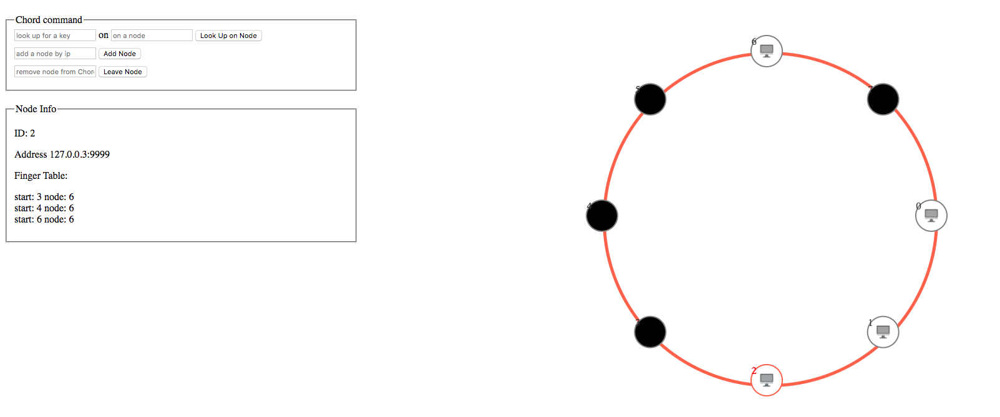

# ds_team_proj_chord

## About
This is an implementation of chord (simulation), a distributed look up algorithm, with an interactive GUI demo ([simple-http-server](https://github.com/keijack/python-simple-http-server) + ajax + jQuery)

## UI of Chord Virtualization

## Reference

- [Chord: A Scalable Peer-to-peer Lookup Service for Internet Applications](https://pdos.csail.mit.edu/papers/chord:sigcomm01/chord_sigcomm.pdf)